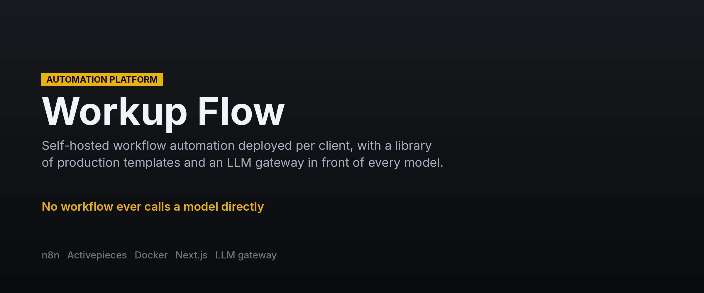
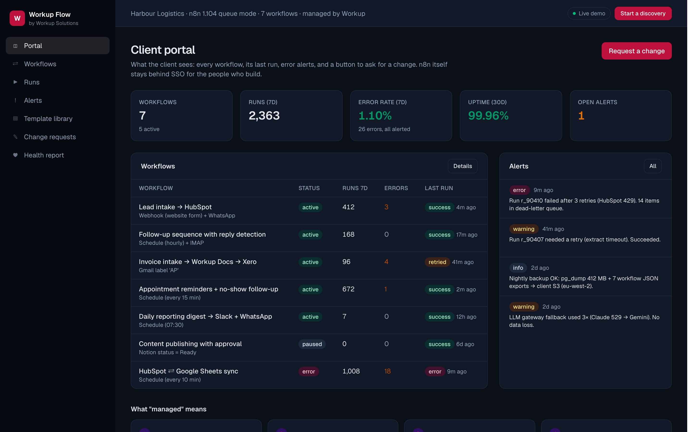

**[← All systems](https://github.com/musabqazi)** · [Voice Receptionist](https://github.com/musabqazi/voice-receptionist) · [Outbound Engine](https://github.com/musabqazi/outbound-engine) · [WhatsApp Agent](https://github.com/musabqazi/whatsapp-agent)

# Automation Platform — managed workflow automation platform

A self-hosted automation platform (n8n, or Activepieces where a permissive licence matters)
deployed per client under the operational standards, with a library of production-grade
workflow templates, an LLM gateway so no workflow ever calls a model directly, monitoring, a
client portal and a managed retainer. The entry product and the glue for the other seven.

runs, alerts, template library, change requests and the weekly health report.

🟢 **Live demo:** https://workup-flow.vercel.app · **Source:** private, available on request

## Dashboard

The client portal: workflow health, run logs and alerts across the deployed template library.

## The problem

Zapier bills, broken zaps nobody owns, data in five tools that do not talk.

## What it does

1. **One-command deploy.** [deploy/](deploy/) — Docker Compose with n8n in queue mode, Postgres,
   Redis, Caddy TLS, nightly pg_dump + workflow export to the client's S3, Uptime Kuma, SSO.
   `./bootstrap.sh flows.client.example`.
2. **Standards on every workflow.** [workflows/](workflows/) — error handler attached, idempotency
   key on every create, retries with backoff on HTTP nodes, no credentials in JSON, a fixture
   payload, a README with the canvas. `npm run lint:workflows` enforces it in CI;
   `npm run deploy:workflows` ships through the n8n public API.
3. **AI through one gateway.** [gateway/](gateway/) — FastAPI service routing Claude / Gemini with
   structured outputs, the checker pattern (second cheaper call + deterministic rules, one retry)
   and Langfuse tracing. Workflows call `/v1/structured` with a task and a schema name.
4. **Watched and reported.** Run log to Postgres, Slack / email alerts, dead-letter queue, weekly
   health report, and the portal the client reads.

## Template library

Lead intake · Follow-up sequences with reply detection · Invoice intake → accounting (calls
Document Intelligence) · Appointment reminders and no-show follow-up (calls Voice Receptionist) · Daily digests ·
Content publishing with approval · Two-way SaaS sync with conflict rules · Error handler.

## Stack

   

## A note on what you can see here

The live demo runs on **seeded demo data** — a fictional tenant and synthetic records throughout. No client data appears in the demo or in this repository, and the implementation is private.

---
Part of the <a href="https://github.com/musabqazi">musabqazi portfolio</a> · source private. © 2026 Musab Qazi
